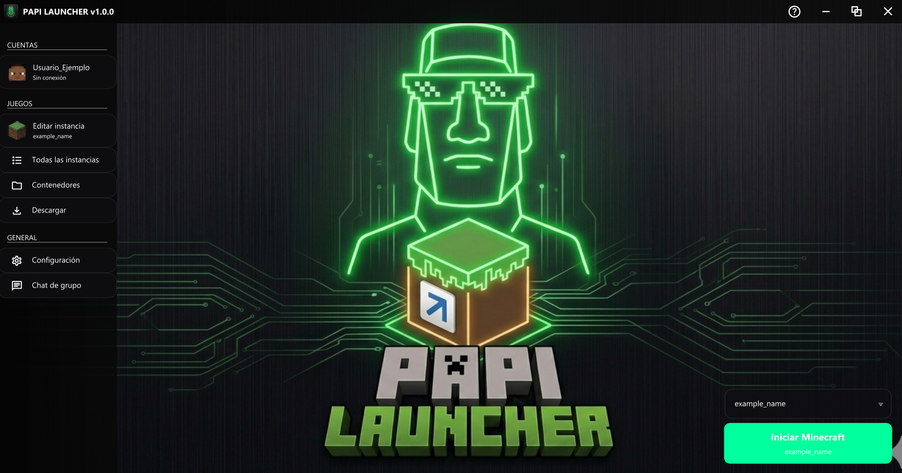
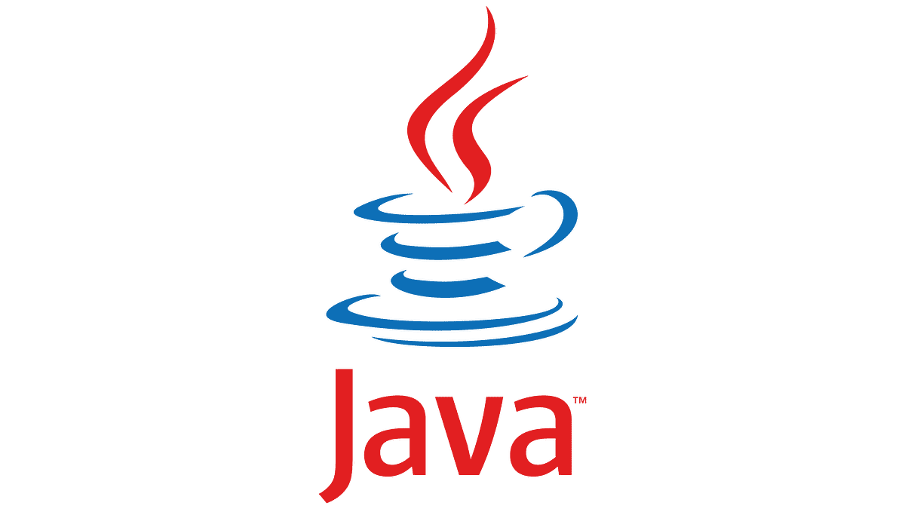

# 🎮 PAPI LAUNCHER

[](https://www.gnu.org/licenses/gpl-3.0)
[](https://adoptium.net/)
[](https://discord.gg/xvHtwE7QUv)
[](https://github.com/endersan17/papi-launcher/releases)

**PAPI LAUNCHER** is a modern, beautiful, and powerful Minecraft launcher. It is an **open-source fork** of **[HMCL (Hello Minecraft! Launcher)](https://github.com/HMCL-dev/HMCL)** with a refreshed interface, neon themes, and smart containers.



## 📜 Project Lineage & Philosophy

This project was born from a simple but important need: **being able to play Minecraft without registering a Microsoft account first**.
HMCL (Original)
│
└── HMCL_offline (intermediate fork)
│
└── Change: Offline accounts enabled by default
│
└── PAPI LAUNCHER (your fork)
└── Based on HMCL_offline + new features


### 🧬 The Original Change
The intermediate fork `HMCL_offline` was based on one clear idea:  
> *"The same HMCL but with offline accounts allowed by default without having to register with Microsoft first."*

Only **one file** was modified:
`HMCL/src/main/java/org/jackhuang/hmcl/ui/account/AccountListPage.java`

**Key changes:**
- Removed restriction logic that hid or blocked the "Offline Account" option.
- Forced `RESTRICTED` variable to `false`.
- Simplified the UI by removing blocking conditionals.

**Diff comparison:** [View Commit](https://github.com/HMCL-dev/HMCL/commit/32b7a60d2ae18c8c416db3ee7d8f8e74eed72205)

> ⚠️ **Note:** The intermediate branch may not stay updated. That's why PAPI LAUNCHER exists as a full independent fork.

---

## 🚀 Key Features

### 🎨 6 Neon Themes with Glassmorphism
- Void Green (`#00FF9D`)
- Blue Launcher (`#00AFFF`)
- Cyan Pulse (`#00FFEE`)
- Electric Purple (`#C300FF`)
- Magenta Glow (`#FF00AA`)
- Acid Lime (`#AAFF00`)

### 📦 Smart Containers
- 3-column layout
- Debounced search
- Per-container launch profiles
- Automatic resource pack validation

### 🚀 Offline Mode + authlib-injector
- **Offline mode enabled by default** (inherited from original change)
- Full authlib-injector support
- Microsoft accounts coming soon

### 🖥️ Multi-platform Support

| Platform   | x86-64 | ARM64 | RISC-V | LoongArch |
|------------|--------|-------|--------|-----------|
| Windows    | ✅     | ✅    | -      | -         |
| Linux      | ✅     | ✅    | ✅     | ✅        |
| macOS      | ✅     | ✅    | -      | -         |
| FreeBSD    | ✅     | ❔    | -      | -         |

### 🌍 Multi-language
Spanish, English, Chinese, Japanese, Russian, Ukrainian, and Traditional Chinese.

### 🔄 Auto-Update + Discord RP
- 3 update channels (Stable, Beta, Nightly)
- Integrated Discord Rich Presence

---

## 📥 Downloads

**Latest version: v1.0.0**

| Platform          | File      | Download |
|-------------------|-----------|----------|
| Windows           | `.exe`    | [Download](assets/oficial/papi-launcher-1.0.0.exe) |
| Linux / macOS     | `.sh`     | [Download](assets/oficial/papi-launcher-1.0.0.sh) |
| Universal (Java)  | `.jar`    | [Download](assets/oficial/papi-launcher-1.0.0.jar) |

> **Note:** The `.jar` works on any OS with Java 11+ installed.

 

---

## 📋 Requirements

**Minimum:**
- **Java:** 11 (minimum) / 17 (recommended) / 21 (ideal)
- **OS:** Windows, Linux, macOS, FreeBSD
- **Architecture:** x86-64, ARM64, RISC-V, LoongArch64

**Main Dependencies:**
Kotlin + Java, JavaFX + JFoenix, Gradle (Kotlin DSL), Gson, JNA, jsoup, nanohttpd, Discord RPC, etc.

---

## 🏗️ Architecture

1. **HMCLBoot** – Bootstrap loader + Java version check + splash screen
2. **HMCLCore** – Authentication, downloads, game launching, mod management
3. **HMCL** – Full JavaFX UI with themes and containers

---

## 🛠️ Build from Source

```bash
git clone https://github.com/endersan17/papi-launcher.git
cd papi-launcher
./gradlew build
java -jar build/libs/papi-launcher-*.jar

📖 Quick Start

Create Offline Account (always available)
Download Minecraft → Choose version → Play
Change Theme → Settings → Appearance
Use Containers → Create new container → Add mods, resource packs, etc.


🤝 Contributing
Contributions are welcome!

Fork the project
Create your feature branch (git checkout -b feature/AmazingFeature)
Commit your changes (git commit -m 'Add some AmazingFeature')
Push to the branch (git push origin feature/AmazingFeature)
Open a Pull Request


👥 Community

Discord: Join Server
YouTube: @papilauncher
GitHub: endersan17/papi-launcher


📜 Credits

endersan17 — Creator of PAPI LAUNCHER
huanghongxun — Original creator of HMCL
SoyStormy — Main contributor & beta tester
All HMCL contributors
Creator of HMCL_offline (the key offline change)


📄 License
This project is licensed under the GNU General Public License v3.0 - see the LICENSE file for details.

Made with ❤️ by endersan17
  